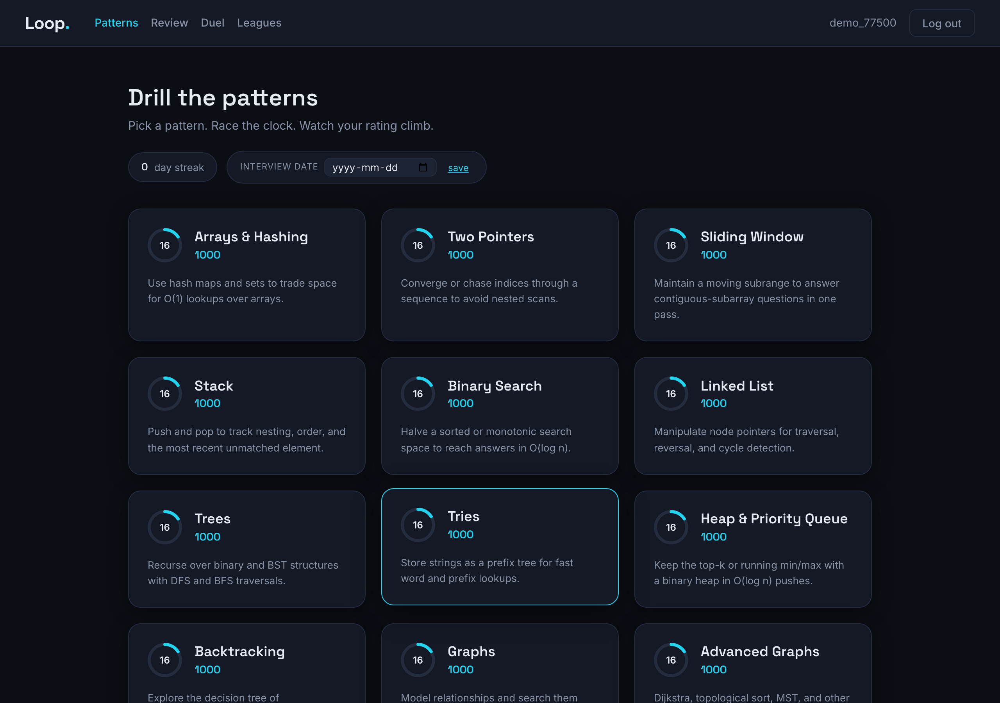
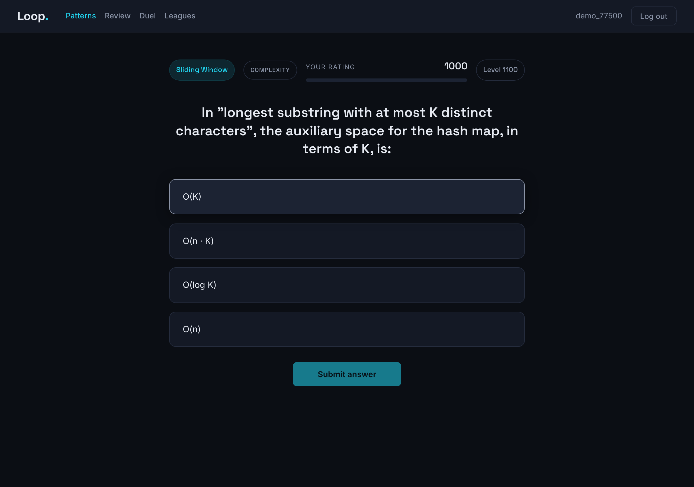
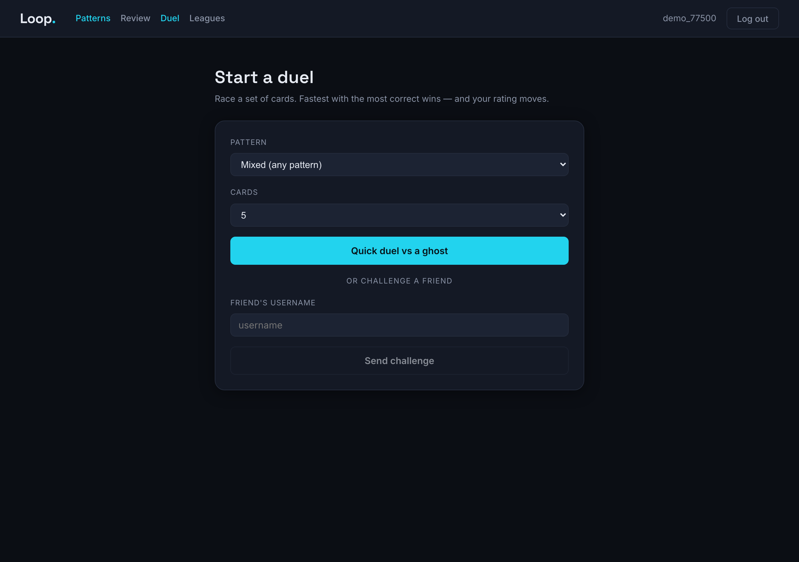
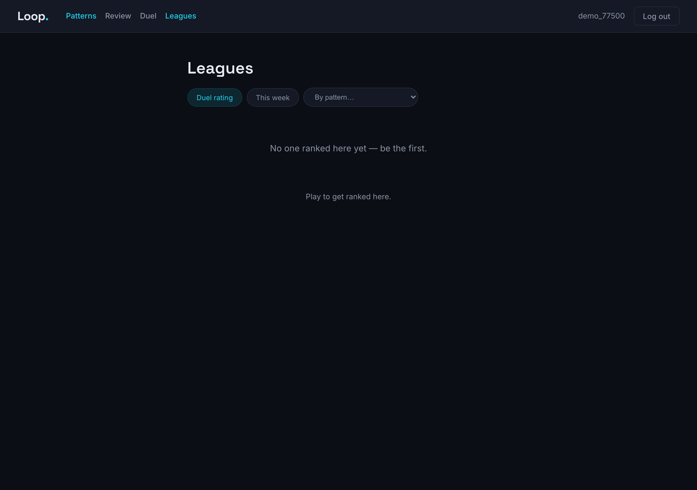
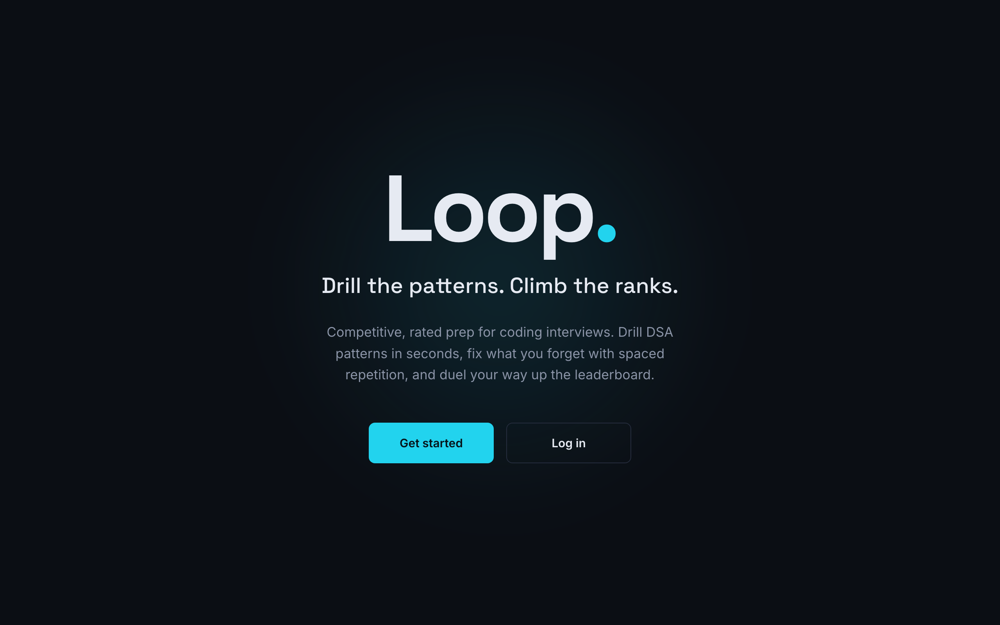

# Loop — Competitive DSA Interview Prep

A competitive, retention-first web app that drills software-engineering candidates on data-structures-and-algorithms patterns with fast, auto-graded cards, a chess-style skill rating, spaced repetition, and head-to-head duels.

> **Live demo:** **[loop-dsa.vercel.app](https://loop-dsa.vercel.app)** · **Tech:** React · Node/Express · PostgreSQL (Row-Level Security)

---

## Visual



| Drilling a card -> instant grading + a live skill rating | Async duels vs a ghost |
| :---: | :---: |
|  |  |
| **Leagues — per-pattern, duel, and weekly ladders** | **The landing page** |
|  |  |

---

## What it does

- **Adaptive drilling.** Pick a DSA pattern, pick a difficulty, and drill cards that adapt to your per-pattern rating. Every answer is graded server-side and updates your rating like a chess Elo rating.
- **Four fast card formats**:
  - **Identify the pattern**: "which pattern solves this?"
  - **Crux step**: the one key line/insight, not the whole solution
  - **Complexity**: time/space analysis under pressure
  - **Spot the bug**: a short snippet with a real defect
- **Async duels.** Race an auto-generated ghost opponent at your level through a card set. Fastest with the most correct wins, and your overall Elo moves. Works even with no one else online.
- **Leagues.** Per-pattern leaderboards, a duel-rating ladder, and a weekly league.
- **Momentum.** Streaks and an interview-date countdown.

## Engineering highlights

- **Server-authoritative grading.** Answer keys are never sent to the browser before you answer; the server grades and computes the rating, so the client can't cheat its score.
- **PostgreSQL Row-Level Security.** Every user's attempts, review state, and duels are isolated at the database layer by per-row policies and a two-role least-privilege setup — not just application checks.
- **Replay-safe & race-safe rating.** First-attempt-only rating via a uniqueness constraint (no farming); duel resolution is serialized with a row lock + atomic claim, so concurrent submits can't double-apply Elo or deadlock.
- **Token auth** with refresh-token rotation and reuse detection; rate limiting, security headers, a CORS allowlist, and schema validation on every request.
- **Content integrity at the schema level**. A `CHECK` constraint rejects a card whose "correct" answer isn't one of its options, so bad content fails loudly at insert.

## Tech stack

| Layer | Tech |
|---|---|
| Frontend | React (CRA), React Router |
| Backend | Node.js, Express |
| Database | PostgreSQL: UUID keys, Row-Level Security, two-role least privilege |
| Auth | JWT access + rotating refresh tokens (bcrypt) |
| Tests | `node:test` + supertest (backend), Jest + Testing Library (frontend) |

## Run it locally

**Prerequisites:** Node 18+, PostgreSQL.

```bash
# 1. Database + content
createdb adaptive_learning
cd backend
npm install
DB_NAME=adaptive_learning npm run setup-db    # schema + roles + 151 cards
cp .env.example .env                           # defaults work for local trust auth
npm start                                       # backend on :3000

# 2. Frontend (in a second terminal, from the repo root)
npm install
echo "REACT_APP_API_URL=http://localhost:3000" > .env
npm start                                       # serves on :3001; sign up and drill
```

Run the tests:

```bash
cd backend && npm test          # backend
npm test                        # frontend (from repo root)
```
